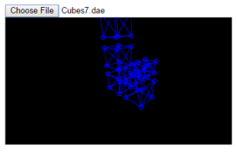

ColladaFileViewer
=================

The JavaScript code in this repository partially implements a rudimentary Collada
file viewer.  To see it in action, open the file Source/ColladaFileViewer.html
in a web browser that runs JavaScript.

A Collada file encodes a scene composed of three-dimensional models.
Its standard file extension is .dae.

A sample .dae file, generated from the default single-cube scene in
Blender3D, is provided in the Samples directory, but this program
will not currently load it correctly.  The code in this repository was
adapted from a much older version, which at the time of its writing,
did successfully open another sample .dae file and render its contents as
wireframes.  But evidently things have changed since then.

